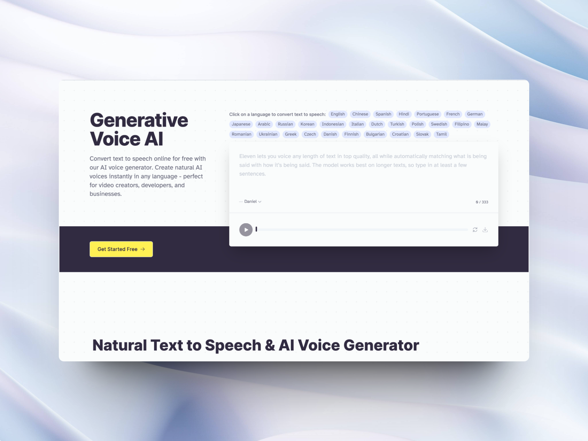

## Finding the right voice

One of my latest ventures has been working with **Elevenlabs**, a company that creates custom voice models for companies. They have a platform that allows you to create your own voice model, and then use it to generate audio. This can be used for many things, but the most common use case is to create a voice for your brand. This can be used for marketing, customer service, or even for your own personal use.

After months of work and exploration, I have a solid understanding of the technology and industry needs.
Both avatars and voices are personal and unique, I would even call it, superpersonal. Meaning that for them to feel as comfortable and real avatars, they need to be a slightly amplified version of themselves, but also not too perfect. This journey had me reading and asking questions to people from many different fields, from linguistics to psychology, actors and directors to understand what makes a voice and a character feel real.

## Tasks

- Create custom voice models
- Direct talent for voice models
- Create production workflows
