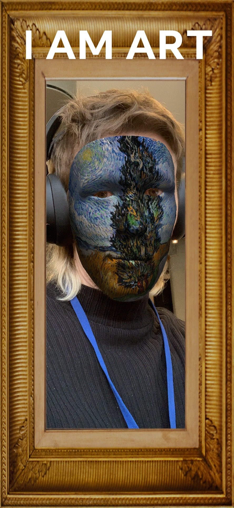

## World Art Day **+** Dell concept

### AR Museum

Interactive gallery for mobile devices in AR

**AR Museum** is an interactive gallery for mobile devices in AR. It allows users to explore the world of art in a new way. The app is designed to be used in a museum or at home. It is a great way to learn about art history and culture. The app is available for iOS and Android devices.

### Instagram filter

User can select any artwork by tapping, from a variety of modern contemporary artists and share their favourite art pieces on social media.

