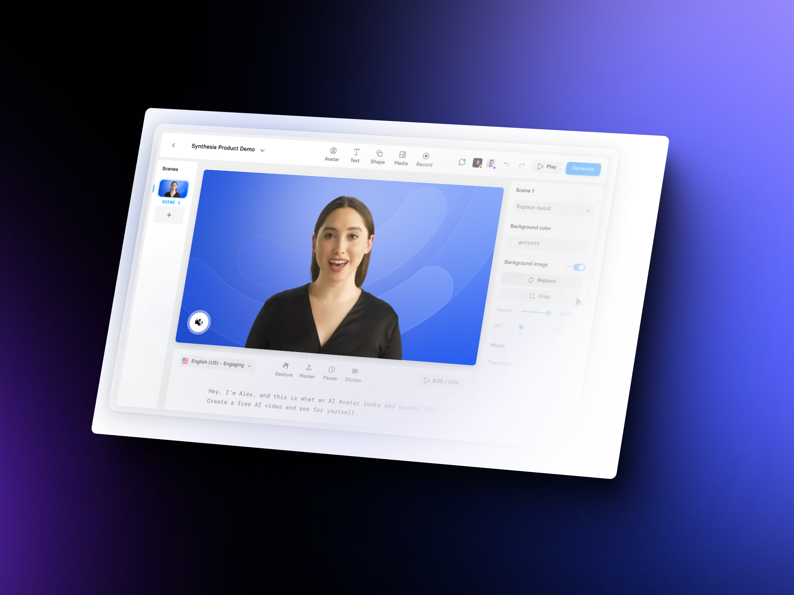

## Synthesia Studio

### Revolutionizing Video Content Creation

Another significant aspect of my work involves Synthesia Studio, a platform that has recently undergone several exciting updates. Synthesia Studio is at the forefront of AI-powered video content creation, offering innovative solutions for localization, social media, and explainer videos.

### Latest Updates in Synthesia Studio

Synthesia Studio has introduced several new features that enhance its capabilities:

  - **Improved Voice Synchronization:** The latest update includes more advanced voice synchronization, making avatars’ lip movements and speech more natural and realistic.
- **Expanded Language Support:** With added languages, Synthesia Studio now caters to an even broader global audience.
- **Enhanced Customization Options:** Users can now customize avatars and backgrounds to better fit their brand’s aesthetic and message.

### Unique Experience with Synthesia Studio

My unique experience with Synthesia Studio involves leveraging these updates to produce high-quality localized content, engaging social media videos, and effective explainer videos for multinational companies.

### Localization

I have used Synthesia Studio to create localized video content for various regions, ensuring that the messaging is culturally relevant and linguistically accurate. This has significantly increased the reach and impact of the content for multinational clients.

### Social Media

For social media campaigns, Synthesia Studio’s customization options have been invaluable. I can quickly produce tailored videos that align with the brand’s voice and visual style, ensuring consistency across all platforms.

### Explainer Videos

Explainer videos are a powerful tool for communicating complex ideas simply and effectively. With Synthesia Studio, I have created engaging explainer videos that break down intricate concepts into easily understandable segments, helping clients convey their messages clearly to diverse audiences.

### Creating High-Quality Personal Avatars

Another critical area of my expertise is creating high-quality personal avatars for clients. This involves a refined process that ensures the avatars are realistic and professional.

#### Refined Process

The process begins with a detailed consultation to understand the client’s needs and preferences. Once the requirements are clear, we proceed with the following steps:

1. **Professional Lighting and Studio Conditions:** To capture the best possible footage, we use professional lighting and studio conditions. This ensures that the avatars have a high level of detail and realism.
2. **Advanced Equipment:** Utilizing the latest cameras and recording equipment, we ensure that every aspect of the avatar’s appearance and movement is captured accurately.
3. **Post-Production Enhancements:** After the initial capture, we use advanced post-production techniques to refine the avatars further. This includes adjustments to lighting, color correction, and fine-tuning movements to make the avatars as lifelike as possible.
4. **Client Feedback and Iteration:** Throughout the process, we involve the client to gather feedback and make necessary adjustments. This iterative approach ensures that the final avatar meets or exceeds the client’s expectations.

#### Applications

These high-quality personal avatars can be used for various purposes, including:

- Brand Representation: Creating a consistent and engaging brand presence.
- Customer Interaction: Enhancing customer service with personalized interactions.
- Marketing Campaigns: Using avatars to create compelling and relatable marketing content.
