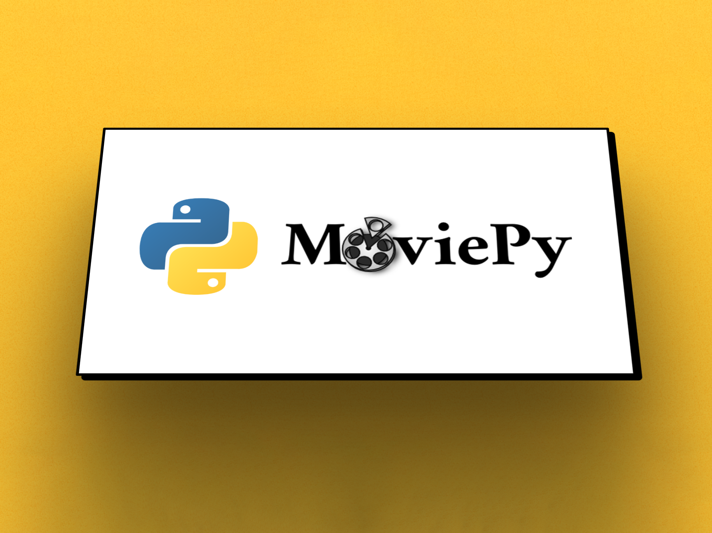

## Automatic Video

This was the project that kickstarted my love for Python. I was asked if I knew of any platform or tool that could create videos in a similar fashion that banners are created, which means in Javascript and in a browser. I knew it was probably possible, but that it would be very difficult to control the output. So I proposed to use Python, as it would be easier to control that kind of process if outside of the browser.

A few weeks later, I had a working prototype that could create videos in a matter of minutes. The process was simple, the user would upload a video, a logo, and a few images. The user would then select a template and the script would do the rest. The script would take the video and stitch together smaller clips, then it would add the logo and images to the clips and finally it would add a soundtrack. The script would then render the video and upload it to the server. The user would then be able to download the video or share it on social media.

### Tasks

- Development of a video creation engine
- Concurrent data retrieval and processing
- Video rendering
- Development of layer alignment and positioning systems
